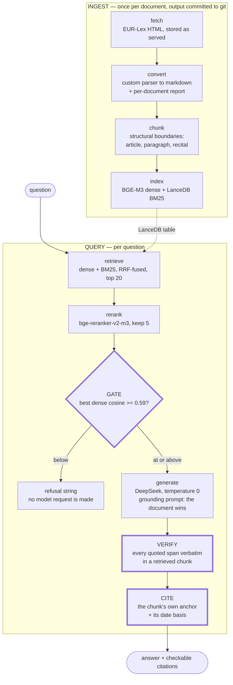

# grc-rag

RAG over regulatory primary sources — the actual text of the instruments,
answered with a citation that can be checked against the article.

Three instruments end to end — the EU AI Act, the GDPR and NIS2 —
**1,739 chunks over six source documents**, a 51-question eval the query
path is graded against, and three mechanical checks in the query path
between the model and a plausible fabrication. *(Every count and result
below is as of 2026-08-18, except where a line says otherwise.)*

Those three checks are load-bearing and they are not a barrier: an audit
of this pipeline enumerated what can go wrong and found seven defect
classes no mechanical check sees, two of them undiscovered until the
audit ran. What each check does and does not cover is in
[docs/defect-classes.md](docs/defect-classes.md), and the honest summary
is in the limitations.

The second instrument is what makes the citation contract load-bearing
rather than decorative: **Article 15 is accuracy and robustness in the AI
Act and the right of access in the GDPR**, so a citation that does not
name the act is not checkable
([D11](docs/decisions.md#d11--the-citation-names-the-instrument-and-the-eval-finally-checks-it)).

No LlamaIndex, no LangChain, no RAG framework — plain Python over
LanceDB, sentence-transformers and an OpenAI-compatible client. That is
the point of the project rather than a constraint on it: a framework
hides the three places where this system decides whether to trust
itself, and those are the parts worth being able to explain.

Every design decision is recorded, with its evidence and its trigger to
revisit, in [docs/decisions.md](docs/decisions.md).

## The pipeline

The three heavy-bordered steps are the mechanical guarantees. Each is a
check with a distinguishable failure mode, not a prompt asking the model
to behave.

## Three guarantees, and the failure each prevents

**1. The gate runs before any model call.** It reads retrieval's best
*dense* cosine alone — never the fused rank, never BM25, which scores
high on any question sharing common words with the corpus and is
therefore the opposite of what a refusal test needs. Below the floor the
answer is a fixed refusal string and **no request is sent**.
*Prevents:* an out-of-corpus question coming back as a fluent answer
assembled from the model's training data, wearing citations to whatever
the retriever happened to return.
The floor is 0.59, tuned from the eval set's measured in-corpus and
out-of-corpus distributions and recorded with them in
[D13](docs/decisions.md#d13--three-instruments-the-gate-is-a-coarse-filter-and-says-so); an untuned floor is decoration. It is placed
**below every in-corpus question**, because only one of the two possible
errors is silent. At three instruments it catches four of the ten
out-of-corpus questions and is honest about being a coarse pre-filter
rather than a guarantee — see the limitations.

**2. Quotes are verified verbatim against the chunks that were
retrieved** — not merely against the corpus, which checks the citation
for free. Every quoted span of 20 characters or more must appear in a
chunk the model was actually given; a cited chunk id naming nothing
retrieved fails the answer outright. Since
[D15](docs/decisions.md#d15--closing-two-blind-spots-the-index-can-be-stale-and-a-real-quote-can-carry-the-wrong-id)
the span must appear in **the chunk the answer pointed at**, not merely
in some retrieved chunk: a real quotation printed beside the wrong id
passed both halves of the old check and sent a reader to a chunk where
the quote is not.
*Prevents:* the quotation that is almost the law — a verb tense adapted
to fit the sentence, an elision that drops a condition, a real article
number attached to words from somewhere else.

**3. Citations are anchor- and provenance-honest.** The rendered citation
is the chunk's own `citation` field plus the date basis it can honestly
claim; nothing in the query path re-derives precision the chunk does not
carry. An enacting-terms chunk cites the consolidated text as of
2026-07-27, a recital cites the act as published, 2024-07-12
([D4](docs/decisions.md#d4--the-corpus-is-two-documents-because-the-recitals-are)).
*Prevents:* the *system's* own fabrication rather than the model's —
"Article 15(4)" rendered for a chunk anchored at Article 15, or a 2024
recital passed off as current consolidated law.

## What it scores

Fifty-one questions in seven kinds — direct, neighbour-adversary,
recital, relocated, cross-instrument, repealed, unanswerable — authored
and signed off **before** anything was tuned against them. Question
design, schema and the run properties worth knowing are in
[eval/README.md](eval/README.md); the per-question run is in
[eval/corpus.eval.report.md](eval/corpus.eval.report.md).

| metric | result | denominator |
| --- | --- | --- |
| retrieval hit rate @5 | **37/39** | the 39 answerable questions |
| citation correctness | **36/39** | same 39, including instrument and date basis |
| refusal correctness | **10/12** | 4 at the gate, 6 in generation, **2 not refused at all** |
| verification clean | **47/51** | every question |

Run 2026-08-18 against `deepseek-chat` at temperature 0.

**Read the refusal row first, because it is the one that got worse.**
Two out-of-corpus questions were answered rather than refused: one about
the Cyber Resilience Act, answered out of NIS2's vulnerability-disclosure
recitals, and one about the CER Directive, answered out of NIS2's
physical-environment provisions. Both answers are `verified True` — every
quote verbatim, every cited id resolving, the instrument correctly named
for the text quoted — and both are wrong, because the question named an
act this corpus does not hold. That failure mode arrives with the third
instrument and no mechanical check in this pipeline sees it
([D13](docs/decisions.md#d13--three-instruments-the-gate-is-a-coarse-filter-and-says-so)).

The remaining misses are diagnosed rather than rounded off. q22 and q39
answered correctly from **recitals** while the enacting article never
entered the top five — twice, in two different instruments; the answer
keys were **not** widened afterwards to make them pass. q29 is an
over-refusal. The rest are the verifier catching quotes the model elided
with an ellipsis, which is the verifier working.

**The worked example.** Drafting eval question q01 — before any tuning
existed — caught a live corpus defect: the converter was treating
EUR-Lex's `25` as a footnote mark, so
Article 51(2)'s 10^25 FLOP threshold for systemic-risk models read
"greater than 10." The conversion report still balanced — its coverage
table accounts for every character as emitted or dropped by a *named*
rule, and these two were dropped by the footnote-mark rule, which was
simply the wrong rule. The eval set is reviewed
and frozen before anything is tuned against it precisely so the answer
key cannot be written by the system it grades — and the first day that
order of operations was tested, it paid for itself. q01 stays in the set
as the standing regression canary: if it ever answers without `10^25`,
the converter has regressed.

## Why the decisions are the interesting part

The register is the intended entry point for a reviewer. Each entry
carries its context, the decision, the cost accepted, and what would make
it wrong.

| | |
| --- | --- |
| [D0](docs/decisions.md#d0--location-backup-classes-model-weights-pre-kickoff) | Location, backup classes, model weights |
| [D1](docs/decisions.md#d1--cli-not-http-service-for-now) | CLI, not HTTP service — with the two constraints that keep the service option cheap |
| [D2](docs/decisions.md#d2--one-public-repo-cis-text-in-no-repo) | One public repo; licensed text in no repo |
| [D3](docs/decisions.md#d3--local-embeddings-cloud-generation-via-deepseek) | Local embeddings, cloud generation — decided per layer, by reversibility |
| [D4](docs/decisions.md#d4--the-corpus-is-two-documents-because-the-recitals-are) | The corpus is two documents, because the recitals are |
| [D5](docs/decisions.md#d5--the-raw-file-is-committed-as-served-the-manifest-carries-two-hashes) | The raw file is committed as served; the manifest carries two hashes |
| [D6](docs/decisions.md#d6--embedding-runtime-and-the-lexical-leg-verified-rather-than-assumed) | Embedding runtime, and the lexical leg verified rather than assumed |
| [D7](docs/decisions.md#d7--relevance-gate-floor-062-on-the-dense-cosine-alone) | Relevance-gate floor: 0.62 on the dense cosine alone |
| [D8](docs/decisions.md#d8--fetching-through-cellar-because-eur-lexs-human-site-challenges-robots) | Fetching through Cellar, because EUR-Lex's human site challenges robots |
| [D9](docs/decisions.md#d9--gdpr-is-two-documents-too-and-the-converter-was-never-ai-act-specific) | GDPR is two documents too, and the converter was never AI-Act-specific |
| [D10](docs/decisions.md#d10--the-gate-floor-after-gdpr-the-clean-gap-was-a-small-sample-artifact) | The gate floor after GDPR: the clean gap was a small-sample artifact |
| [D11](docs/decisions.md#d11--the-citation-names-the-instrument-and-the-eval-finally-checks-it) | The citation names the instrument, and the eval finally checks it |
| [D12](docs/decisions.md#d12--nis2-the-rowspan-defect-and-the-third-kind-of-wrong) | NIS2, the rowspan defect, and the third kind of wrong |
| [D13](docs/decisions.md#d13--three-instruments-the-gate-is-a-coarse-filter-and-says-so) | Three instruments: the gate is a coarse filter, and says so |
| [D14](docs/decisions.md#d14--the-audit-the-gate-stays-its-demotion-is-falsified-and-the-blind-spots-get-names) | The audit: the gate stays, its demotion is falsified, and the blind spots get names |
| [D15](docs/decisions.md#d15--closing-two-blind-spots-the-index-can-be-stale-and-a-real-quote-can-carry-the-wrong-id) | Closing two blind spots: the index can be stale, and a real quote can carry the wrong id |
| [D16](docs/decisions.md#d16--n5-the-regime-pre-flight-adopted-narrowly-and-what-the-measurement-cost-the-premise) | N5: the regime pre-flight, adopted narrowly, and what the measurement cost the premise |

If you read two, read
[D4](docs/decisions.md#d4--the-corpus-is-two-documents-because-the-recitals-are)
and
[D7](docs/decisions.md#d7--relevance-gate-floor-062-on-the-dense-cosine-alone):
one is a measurement that changed the corpus design, the other a number
nobody should take on faith. The architecture brief this project was
built from is kept at
[docs/original-brief.md](docs/original-brief.md) — history, not a spec;
the register supersedes it where they disagree.

## Layout

    src/grc_rag/fetch/     network allowed; writes corpus/raw/ + manifests
    src/grc_rag/convert/   deterministic and offline; writes markdown + chunks
    src/grc_rag/query/     network allowed; index build, engine, CLI
    tests/                 checks, independent of the pipeline they check
    corpus/                raw source, manifests, canonical markdown, chunks
    eval/                  the 51-question graded set, its README, the committed report
    diagnostics/           measurement instruments that are NOT the graded set
    docs/                  decision register, defect-class inventory, briefs
    docs/kickoffs/         how each session was framed before it ran

Those three package directories are the three import buckets — `convert`
may not import a network module, a clock or an entropy source, because
byte-identical reruns are the property that bucket sells — and
`tests/check-imports.py` is what makes them a check instead of a claim.
A module in none of the three buckets fails the run rather than
classifying itself by the directory it was dropped into.

## Quickstart

Everything runs in WSL2/Ubuntu under [uv](https://docs.astral.sh/uv/).
The corpus and the eval set are committed; only the index has to be
built. The virtualenv lives on ext4 rather than in the repo on `/mnt/d`:
it is ~5 GB of small files — torch plus the CUDA runtime libraries — and
imports slowly across the NTFS boundary, the same reason the model
weights stay in the Hugging Face cache ([D0](docs/decisions.md#d0--location-backup-classes-model-weights-pre-kickoff)).
Export this once per shell, or `uv` will build a `.venv` in the repo:

    export UV_PROJECT_ENVIRONMENT=$HOME/.venvs/grc-rag

    uv sync

    # generation goes to an OpenAI-compatible endpoint; the default is DeepSeek
    cp .env.example .env        # then fill in DEEPSEEK_API_KEY

    # build the index from the committed chunks
    # (gitignored, ~4.6 MB, 41 s on an RTX 3500 Ada once BGE-M3 is cached)
    uv run python -m grc_rag.query.index

    # …and confirm it is serving what is committed, not a stale build
    uv run python tests/index-current.py

    uv run python -m grc_rag.query.cli ask \
        "what compute threshold makes a general-purpose AI model presumed to have systemic risk?"

`ask` prints the answer, then the gate's dense score against the floor,
then every chunk the model was given with its scores and rendered
citation, then one line per quoted span saying whether it verified. Its
exit code is the verifier's: non-zero if any quote or cited id did not
check out.

| command | what it does |
| --- | --- |
| `ask "…"` | retrieve, gate, answer, verify |
| `show "…"` | retrieval only — scores and chunks, no model call |
| `repl` | models load once, ask many |
| `floor` | score the eval set as the gate sees it; say where a floor belongs |
| `eval` | run the eval set, write the report |
| `sentinel` | context-integrity round-trip — silent truncation looks fine otherwise |
| `selftest` | offline verifier checks; `--with-models` also loads the reranker |

`repl` exists because loading BGE-M3 and the reranker costs more than
answering does — which is also why this is a CLI over an importable core
rather than an HTTP service
([D1](docs/decisions.md#d1--cli-not-http-service-for-now)).

### The checks

Six standing checks, each failing differently, plus the query path's own
selftest. All seven pass as of 2026-08-19:

    uv run python tests/check-imports.py         # the three buckets hold
    uv run bash tests/probe-check.sh             # …and that check can actually fail
    uv run bash tests/rerun-identical.sh         # byte-identical reruns; corpus not stale
    uv run python tests/seqcheck-corpus.py both  # source text present IN ORDER
    uv run python tests/index-current.py         # the INDEX serves the committed chunks
    uv run bash tests/index-probe.sh             # …and that check can actually fail
    uv run python -m grc_rag.query.cli selftest  # verifier normalisation, matching, attribution

`probe-check.sh` drops an unclassified module into the package and
requires the import check to fail *naming it*, with a clean run either
side — a control nobody has watched fail is a control nobody has tested.
`index-probe.sh` does the same for index currency, doctoring the
manifest rather than the corpus so a probe that dies halfway leaves
nothing to clean up.
`seqcheck-corpus.py` compares the corpus against an independent regex
extraction of the same raw HTML, in order: every bag-of-words check is
blind to text shredded into the wrong sequence, which is how a corrupted
corpus passes three checks and still poisons every answer.

`index-current.py` is the newest and closes the quietest hole
([D15](docs/decisions.md#d15--closing-two-blind-spots-the-index-can-be-stale-and-a-real-quote-can-carry-the-wrong-id)).
`index/` is Class C — gitignored and rebuildable — and nothing tied it
to the chunk files in git. Edit a chunk, commit, forget to rebuild, and
every other check still passes: the verifier matches quotes against the
bodies the *index* served, so an index built from superseded chunks
verifies its own answers and the whole pipeline agrees with itself while
disagreeing with the repository. The build now stamps the six chunk
files' SHA-256 and the embedder name into `index/source-manifest.json`;
this compares them, and distinguishes "not built yet" (exit 2) from
"disagrees" (exit 1), because a check that answers *no* the same way for
both trains people to ignore it.

### Rebuilding the corpus from source

Not needed to run the system — the markdown is the committed artifact,
and `rerun-identical.sh` re-executes the convert and chunk halves on
every check. This is how it was produced:

    uv run python -m grc_rag.fetch.eurlex --celex 32024R1689 \
        --consolidated --original --expect 02024R1689-20260727
    uv run python -m grc_rag.convert.eurlex_html \
        --raw corpus/raw/eu/ai-act/02024R1689-20260727.en.html \
        --part enacting --out corpus/eu/ai-act.md
    uv run python -m grc_rag.convert.eurlex_html \
        --raw corpus/raw/eu/ai-act/32024R1689.en.html \
        --part recitals --out corpus/eu/ai-act.recitals.md
    uv run python -m grc_rag.convert.chunk --doc corpus/eu/ai-act.md
    uv run python -m grc_rag.convert.chunk --doc corpus/eu/ai-act.recitals.md

The GDPR half:

    uv run python -m grc_rag.fetch.eurlex --celex 32016R0679 \
        --consolidated --original --expect 02016R0679-20160504 \
        --out corpus/raw/eu/gdpr
    uv run python -m grc_rag.convert.eurlex_html \
        --raw corpus/raw/eu/gdpr/02016R0679-20160504.en.html \
        --part enacting --instrument "GDPR" --out corpus/eu/gdpr.md
    uv run python -m grc_rag.convert.eurlex_html \
        --raw corpus/raw/eu/gdpr/32016R0679.en.html \
        --part recitals --instrument "GDPR" --out corpus/eu/gdpr.recitals.md
    uv run python -m grc_rag.convert.chunk --doc corpus/eu/gdpr.md
    uv run python -m grc_rag.convert.chunk --doc corpus/eu/gdpr.recitals.md

NIS2, converted but not yet chunked:

    uv run python -m grc_rag.fetch.eurlex --celex 32022L2555 \
        --consolidated --original --expect 02022L2555-20221227 \
        --out corpus/raw/eu/nis2
    uv run python -m grc_rag.convert.eurlex_html \
        --raw corpus/raw/eu/nis2/02022L2555-20221227.en.html \
        --part enacting --instrument "NIS2" --out corpus/eu/nis2.md
    uv run python -m grc_rag.convert.eurlex_html \
        --raw corpus/raw/eu/nis2/32022L2555.en.html \
        --part recitals --instrument "NIS2" --out corpus/eu/nis2.recitals.md

The fetcher defaults to the Publications Office's Cellar service rather
than EUR-Lex's human site, which answers automated requests with a bot
challenge; `--source legal-content` selects the old route, and the two
serve the same ELI-tagged HTML
([D8](docs/decisions.md#d8--fetching-through-cellar-because-eur-lexs-human-site-challenges-robots)). Run it without `--expect`
first and read the consolidated id it discovers — that identifier is
never taken from memory.

Two documents, because a EUR-Lex consolidation carries the enacting terms
and annexes but no recitals at all
([D4](docs/decisions.md#d4--the-corpus-is-two-documents-because-the-recitals-are)).
The conversion reports (`corpus/eu/*.report.md`,
`corpus/chunks/*.report.md`) are meant to be read by eye, not merely
exited on: they account for every character in the source as emitted or
dropped by a named rule, and every real defect this project has found was
invisible in the totals and obvious on sight.

## Limitations

Stated because a system whose limits are unwritten gets trusted past
them.

- **Three instruments, one language.** The EU AI Act, the GDPR and NIS2
  in English, 1,739 chunks — small enough that retrieval quality here
  says little about how this behaves at ten instruments.
- **A question about a FOURTH act can be answered from these three.**
  The worst result in the M9 eval: questions about the Cyber Resilience
  Act and the CER Directive were answered, fluently and with verbatim
  verified quotes, out of adjacent NIS2 provisions. The verifier, the
  citation contract and the gate all passed them. Every instrument added
  makes this likelier, because there is always something topically
  adjacent to answer from ([D13](docs/decisions.md#d13--three-instruments-the-gate-is-a-coarse-filter-and-says-so)).
  **How often depends entirely on how the question is phrased**, which
  D16 measured: name the absent act ("what does DORA require…") and the
  system refuses 25 times out of 26; carry the regime implicitly in a
  term of art ("a manufacturer of a product with digital elements") and
  it answers wrongly 5 times out of 15. A regime pre-flight that halves
  the second figure at no measured cost in false refusals is designed
  and measured in
  [D16](docs/decisions.md#d16--n5-the-regime-pre-flight-adopted-narrowly-and-what-the-measurement-cost-the-premise),
  and is **not yet implemented** — the numbers above are the system as
  it stands.
- **The gate is a coarse pre-filter, and the measurement says so.** It
  has caught **exactly four questions in every measurement** while the
  out-of-corpus set grew from four to ten: 4/4 at one instrument, 4/8 at
  two, 4/10 at three. A question about European cybersecurity
  certification scored 0.7460 — above 34 of the 39 answerable ones — so
  no usable floor catches it. A dense cosine separates questions whose
  vocabulary the corpus does not share at all, and nothing finer. The
  floor sits below every in-corpus question because of the two errors
  only a false refusal is silent; the rest is the generator's job, which
  it does imperfectly (above). Fixing this is a redesign, not a re-tune
  ([D13](docs/decisions.md#d13--three-instruments-the-gate-is-a-coarse-filter-and-says-so)).
- **Nothing automated checks table STRUCTURE.** The coverage table sees a
  multiset of characters and the sequence check sees their order; a cell
  landing in the wrong column is neither. NIS2's annexes arrived with
  `rowspan` up to 17 and the converter had never implemented spans, so
  entity names rendered under *Sector* — every automated check passed.
  It was caught by reading the table at Gate A, which is currently the
  only thing that would catch the next one
  ([D12](docs/decisions.md#d12--nis2-the-rowspan-defect-and-the-third-kind-of-wrong)).
- **The verifier checks quotations, not paraphrase.** An unquoted claim
  is held up by the grounding prompt and the cited-id check alone.
  Quoting is what makes a claim mechanically checkable, which is why the
  prompt demands it — an answer that paraphrases everything is weakly
  checked, and the CLI says so rather than passing it silently.
- **Seven defect classes have no mechanical check at all**, out of
  twenty-four enumerated in
  [docs/defect-classes.md](docs/defect-classes.md). Four are accepted
  with eyes open and named elsewhere in this list; the other three are
  the conversion classes a human catches at Gate A or not at all. The
  inventory exists because two of the four real defects this project has
  found passed every automated check, and enumerating the classes was
  cheaper than discovering them one instrument at a time
  ([D14](docs/decisions.md#d14--the-audit-the-gate-stays-its-demotion-is-falsified-and-the-blind-spots-get-names)).
- **DeepSeek at temperature 0 is not run-to-run deterministic.** The
  committed report is one run's numbers, not a constant of the system:
  individual questions have flipped between a clean answer and a hedged
  refusal across identical runs (eval README). Temperature 0 reduces
  variance; it is not the groundedness guarantee. The verifier and the
  citation contract are.
- **Fifty-one questions, one author.** The eval is a regression instrument,
  not a benchmark, and it grades retrieval, citation and refusal — not
  whether the answer is good legal analysis.
- **No CI, no HTTP service, manual commits**, all by design (D1, D2).
  The checks are run by hand at every session close.

## Roadmap

Phase 2 is the same code with different identifiers: **GDPR, NIS2, DORA**
from EUR-Lex, then NIST (OSCAL and CPRT structured exports), CIS Controls
as a local-only source whose text enters no repo
([D2](docs/decisions.md#d2--one-public-repo-cis-text-in-no-repo)), and
ENISA guidance, which is where a PDF parser is finally justified.

One consequence worth naming now: adding an instrument turns today's
out-of-corpus eval questions into in-corpus ones. At that point the eval
set needs new refusal rows and the floor needs re-measuring — not just a
re-run.

## License and provenance

The code is MIT ([LICENSE](LICENSE)). That covers the code only — the
corpus is not the author's to license.

The corpus is EU primary law reproduced from EUR-Lex, with `celex`,
`source_url`, `source_sha256` and `version_date` in each file's front
matter and a fetch manifest beside the raw HTML. It is not an official
version of the law; EUR-Lex is. Conventions, the dependency list and the
two hard gates this project was built through are in
[AGENTS.md](AGENTS.md).
